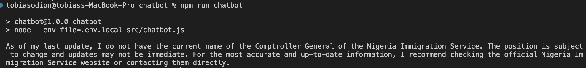
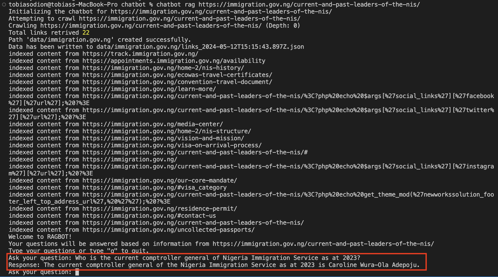

# RAG Tutorial

An overview of the RAG architecture for improving and adapting LLM to specific use cases. This CLI chatbot app allow users to ask questions about a website which is provided as context. This chatbot empowers users to retrieve information from a website that may not have been in the training dataset of open source LLMs.

## Use case

### Without RAG

Asking the OpenAI GPT LLM about the Nigerian Immigration service(Question: _Who is the current comptroller general of Nigeria Immigration service?_) as is the case of the simple chatbot script `chatbot.js` by running the script `npm run chatbot` will not give useful information as shown below:

### With RAG

By using the CLI website chatbot which extends the OpenAI GPT LLM with RAG we get a more useful result. We can use this chatbot by running `chatbot start https://immigration.gov.ng/current-and-past-leaders-of-the-nis/` and asking the same question - _Who is the current comptroller general of Nigeria Immigration service?_. This gives a more useful result as shown below:

**NB** The initialization of the chatbot can be seen in the image. During the initialization, the bot crawls the website to the provided depth(default = 0), and indexes the data from the crawled links to an In-Memory vectore store which the bot uses as context in responidng to questions.

#### How it works

The chatbot crawls the given url and indexes the content which it uses as context to respond to users' questions. Hence, the chatbot tries to generate responses from the provided context. The more information within the context(pages crawled by the chatbot), the more likely the model will generate a response. However, the quality and accuracy of these responses are subject to the quality and accuracy of information on the website which serves as context for the chatbot under the RAG architecture.

## To run Locally

### Requirements

- OpenAI - API key

### Steps

- Link the CLI app to the OS by running `npm link`
- Install dependencies by running `npm install`
- create a copy of the .env.example file by running `cp .env.example .env.local` in terminal
- update the env variables with the required keys in the `.env.local` file created in the previous step.
- Run the simple version by running `npm run chatbot`
- Start the chatbot by running `chatbot start <url>`
- Configure the crawl depth by using the `--depth` parameter by running `chatbot start <url> --depth <number>`. The default crawl depth is 0

**NB:**

- Be careful when changing the default crawl depth in order to protect the memory because the crawled website contents are indexed In-Memory. Hence, the higher the crawl depth the more the memory that will be needed to index the website data.
- I will recommend a max crawl depth of 2 to be on the safe side. However, you must apply caution and take into consideration the memory of your machine.
- This project is intended for learning purposes where the crawl depth(by extension data volume) is expected to be as minimal as possible. If you wish to use in a production environment where the data volume is expected to be high, kindly use a third-party VectorDB service provider(e.g [qdrant](https://qdrant.tech/), [pinecone](https://www.pinecone.io/),[mongodb](https://www.mongodb.com/docs/atlas/atlas-vector-search/tutorials/vector-search-quick-start/#objectives))

References
[Langchain documentation](https://js.langchain.com/docs/get_started/quickstart)
[OpenAI API](https://platform.openai.com/api-keys)
[Embeddings](https://platform.openai.com/docs/guides/embeddings)
[RAG Article](https://medium.com/@bijit211987/rag-vs-vectordb-2c8cb3e0ee52)
[VectorDB Service](https://qdrant.tech/)

Watch Recording [here](https://drive.google.com/file/d/1goNpRpVwbPUdBUx5CHHMY8kBMS9SW05I/view?usp=drive_link)
